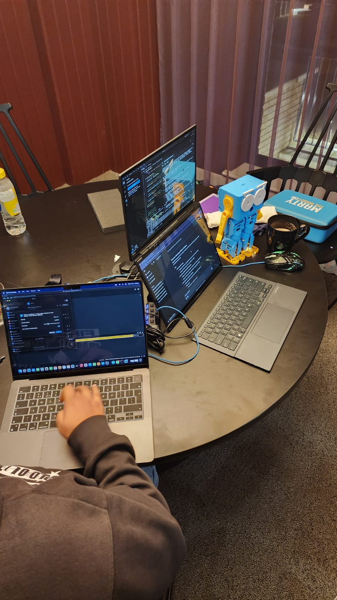

# HRI Marty – Voice-Controlled Storytelling Robot (Group 6)

A Human–Robot Interaction (HRI) coursework project that turns **Marty the Robot** into a **voice-driven storytelling companion**.  
The system connects **speech input → transcription → dialogue/story response → text-to-speech output**, with robot actions executed in sync where applicable.

> **Repository:** https://github.com/ajumon2001/HRI-Marty-Group-6  
> **Primary entry point:** `agent.py`  
> **Media gallery:** [assets/ASSETS.md](assets/ASSETS.md)

---

## What This Project Demonstrates

This project is designed to showcase an end-to-end HRI pipeline with real-world constraints:

- Building an interactive robot experience around **voice**
- Integrating modules in a reliable loop: **Listen → Understand → Respond → Speak**
- Handling practical engineering challenges: **audio issues**, **device connection**, and **runtime stability**
- Producing evidence through repeatable runthroughs and documented outputs

---

## Quick Proof (Media)

### Main Model


### Integration & Testing (Debugging Stage)
These videos capture the development phase where we integrated modules and resolved real-world issues (sound, movement timing, runtime stability, and connection reliability):

- [Testing 1](assets/videos/testing-1.mp4)
- [Testing 2](assets/videos/testing-2.mp4)

### Programming / Integration Workflow
This screenshot shows the integration and debugging workflow (VS Code-based development and module testing):



### Results (Stable Runthroughs)
- [Runthrough 1](assets/videos/runthrough-1.mp4)
- [Runthrough 2](assets/videos/runthrough-2.mp4)
- [Runthrough 3](assets/videos/runthrough-3.mp4)

---

## System Overview

At a high level, the interaction loop is:

1. **Audio capture** from microphone
2. **Speech-to-text transcription** (`transcriber.py`)
3. **Agent orchestration** and response generation (`agent.py`)
4. **Text-to-speech output** generation (`tts.py`)
5. **Playback + robot interaction** (where applicable)

The implementation is modular so components can be tested independently.

---

## Key Engineering Challenges (and What We Did)

### 1) Integration and Control Workflow
During development, we integrated interaction logic with robot control and real-time behaviour.  
This included running and testing the stack through **VS Code**, structuring the project into clear modules, and validating each component independently before running full end-to-end demos.

Evidence:
- `assets/images/programming.jpeg`

### 2) Audio Pipeline Issues (Sound Input/Output Reliability)
We faced multiple practical issues common in voice-driven HRI systems:
- Microphone device selection inconsistencies
- Unstable audio capture and playback during repeated runs
- Intermittent failures during integration testing

What we did:
- Added dedicated scripts to isolate and validate the audio pipeline
- Tested recording and playback independently before reintegrating the full loop
- Stabilised the flow through repeatable test runs and careful module separation

Evidence:
- `assets/videos/testing-1.mp4`, `assets/videos/testing-2.mp4`  
Supporting scripts:
- `sound_test.py`, `simple_recorder.py`

### 3) Real-Time Communication and Connection Stability
We experienced issues related to real-time interaction, including:
- Connection instability during live testing
- Timing/latency problems affecting responsiveness
- Occasional failures where robot behaviour did not sync cleanly with the pipeline

What we did:
- Moved to a more reliable workflow: validate each stage (record → transcribe → respond → TTS) independently, then run as a coordinated pipeline.
- Focused on repeatability and stability in the complete loop for final demonstrations.

Evidence:
- `assets/videos/runthrough-1.mp4`
- `assets/videos/runthrough-2.mp4`
- `assets/videos/runthrough-3.mp4`

---

## Project Structure

| File | Purpose |
|------|---------|
| `agent.py` | Main orchestrator for the interaction loop |
| `transcriber.py` | Speech-to-text logic (audio → text) |
| `tts.py` | Text-to-speech generation (text → audio) |
| `simple_recorder.py` | Utility to record microphone input |
| `sound_test.py` | Audio device and pipeline sanity tests |
| `func_def.py` | Supporting functions used by the agent |
| `realtime.js` | Optional real-time interface logic (integration/testing) |
| `test.ipynb` | Notebook for experimentation and iteration |
| `output.mp3`, `temp.mp3` | Example audio outputs from runs |

---

## How To Run (Typical)

### 1) Clone
```bash
git clone https://github.com/ajumon2001/HRI-Marty-Group-6.git
cd HRI-Marty-Group-6

